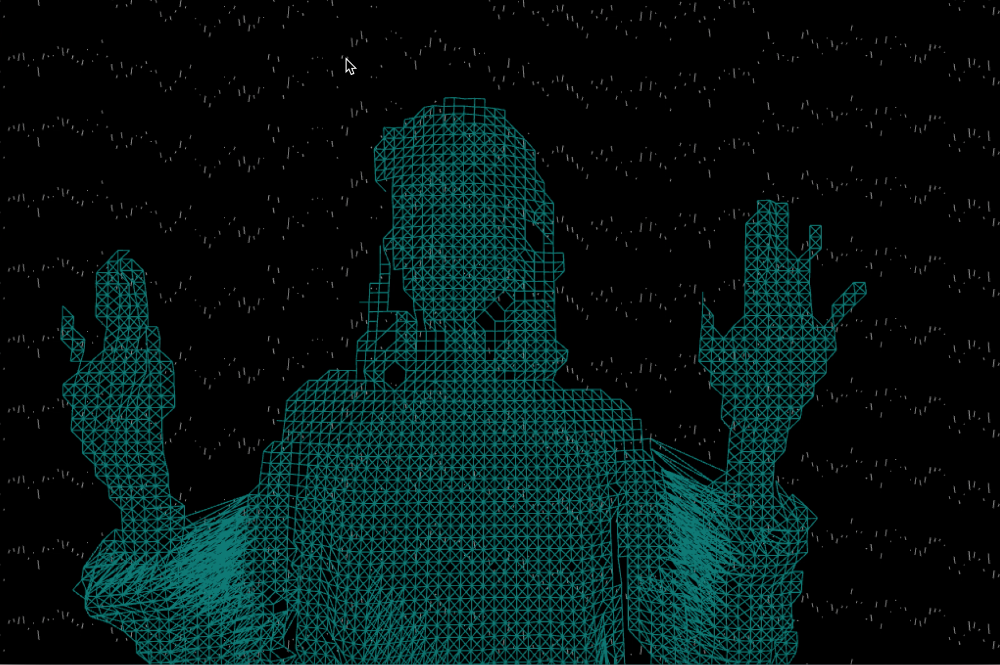

# iml-404-tacticalmedia-fall2016
Homework for IML-404 Tactical Media (Fall 2016).

1. assign2  
Depth of Music
This project uses Kinect for depth map and motion sensing to render and interact the objects with sound frequency from audio music. It aims to visualize music in real-time with people’s interaction.
  <iframe src="https://player.vimeo.com/video/187938291" width="640" height="360" frameborder="0" webkitallowfullscreen mozallowfullscreen allowfullscreen></iframe>

<a href="https://vimeo.com/187938291">Video documentation (Vimeo)</a>

  
